# Bitget Agentic Architecture

## Full high-level architecture and end-to-end flow

**Repository:** `hernanda-git/bitget-agentic-architecture`
**Runtime modes:** `shadow`, `paper`, `testnet`, and a separately gated `live` design
**Current operational posture:** offline paper and public-data research only
**Funded execution:** disabled
**Timezone for displayed timestamps:** `Asia/Jakarta`
**Canonical timestamps:** stored in machine-readable form for replay and audit

> This document explains how the system is designed to run, what is implemented, what is measurement-only, and which gates prevent unsafe execution. It is an architecture and operating guide, not a profitability claim.

---

## 1. The central idea

The system is an autonomous decision pipeline, not an unrestricted AI trader.

```text
Market data is observed.
Features and strategies produce candidates.
An agent may analyze or rank bounded candidates.
Deterministic policy decides what is allowed.
Sizing calculates the actual quantity.
Execution uses typed intents.
Protection and reconciliation verify state.
The ledger records the entire trace.
```

The authority order is:

1. Venue and market-data truth
2. Deterministic safety policy
3. Deterministic sizing and portfolio risk
4. Execution and protection verification
5. Bounded model proposal or ranking
6. Human governance at deployment and funding boundaries

The model is never the source of truth for price, balance, fill, position, fee, liquidation price, or protection state.

---

## 2. System context

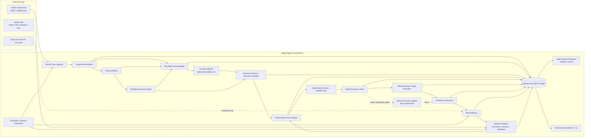

### Component responsibilities

| Component | Responsibility | Authority | Current status |
|---|---|---|---|
| Market Data Gateway | Fetches public observations and validates transport, schema, timestamps, and freshness | External data is untrusted input | Implemented for public shadow |
| Snapshot Normalizer | Converts venue payloads to stable internal snapshots | Normalization only | Implemented |
| Feature Builder | Computes versioned features from snapshots | Deterministic | Implemented |
| Strategy Research Engine | Generates candidate signals and regime labels | Proposes candidates only | Implemented and expanding |
| Context Builder | Creates bounded structured context | Cannot include secrets | Implemented conceptually and in runtime paths |
| Provider Adapter | Abstracts the selected inference provider | No execution authority | Provider-pinned cron configuration |
| Decision Validator | Checks JSON shape and semantic validity | Rejects malformed output | Implemented |
| Policy Engine | Enforces hard rules | Final entry permission | Implemented |
| Sizing and Risk | Calculates actual quantity and portfolio impact | Overrides provider quantity | Implemented |
| Execution Intent | Typed, idempotent proposed action | No direct signing | Implemented for paper |
| FakeExchange | Simulates fills, fees, funding, spread, slippage, stops, targets | Deterministic paper authority | Implemented |
| Venue Adapter | Future authenticated exchange adapter | Must be separately gated | Not active |
| Protection Supervisor | Ensures stop and target state | Safety authority | Paper coverage implemented |
| Reconciliation | Compares external state with local state | Venue read-back authority | Paper and design coverage |
| Breaker Registry | Parks new entries under unsafe conditions | Deterministic only | Resource and heartbeat breakers wired |
| Ledger | Stores immutable runtime evidence | Audit authority | Implemented with SQLite |
| Evaluator | Measures out-of-sample behavior and costs | Promotion evidence only | Implemented and expanding |
| Dashboard | Read-only projection of measured state | No execution authority | Implemented and browser-verified |
| Scheduler | Drives periodic observations and monitors | Operational orchestration | Cron configured, gateway dependent |

---

## 3. Operating modes

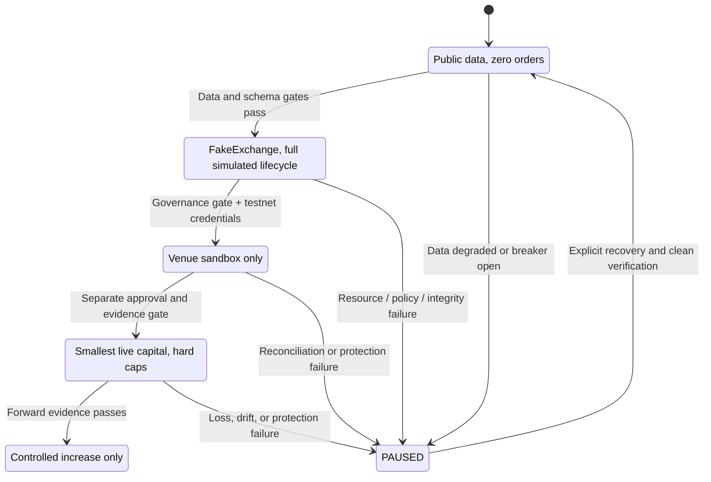

### `shadow`

- Uses public unauthenticated data only.
- Produces observations, features, decisions, and hypothetical dispositions.
- Places zero orders.
- Does not use exchange signing credentials.

### `paper`

- Uses the complete decision and execution path.
- Sends typed intents to `FakeExchange`.
- Models fills, partial fills, fees, funding, spread, slippage, stops, targets, and end-of-replay closure.
- Produces actual paper ledger records.

### `testnet`

- Future venue sandbox mode.
- Requires separate credentials and explicit testnet configuration.
- Must prove order, fill, protection, and reconciliation read-back.
- Must not reuse funded credentials.

### `live`

- Designed but disabled by default.
- Requires all governance, statistical, operational, protection, reconciliation, and forward-evidence gates.
- No current code path is authorized to activate funded trading automatically.

---

## 4. Market-data flow

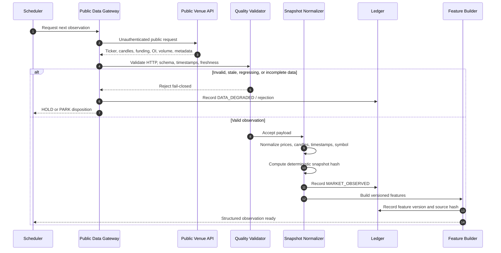

### Data-quality rules

The gateway must fail closed on:

- Missing required fields
- Non-positive prices
- Bid greater than ask
- Invalid symbols or products
- Timestamp regression
- Future-dated observations
- Stale snapshots
- Incomplete candle windows
- Chronologically reordered candles
- Mixed-symbol replay inputs
- Missing or inconsistent snapshot hashes
- Rate limits, provider outages, and malformed responses

A mark price does not have to lie inside the quoted bid and ask. It must be positive, while bid and ask must be positive and ordered.

Slow data series are joined using the nearest bucket at or before the decision timestamp. Future values are never used.

---

## 5. One runtime decision cycle

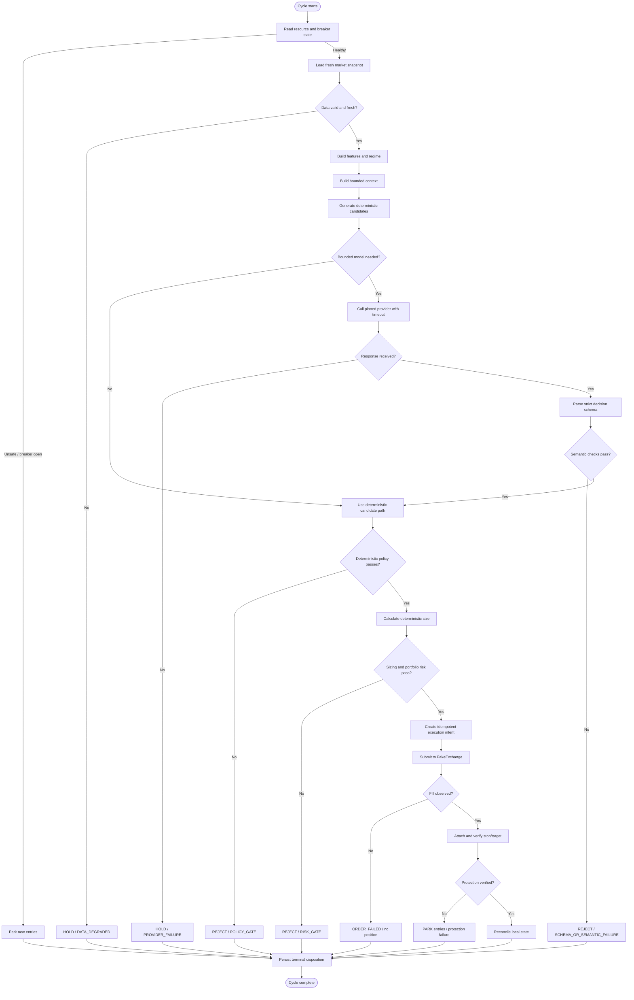

Every cycle ends in a terminal disposition:

```text
EXECUTED
REJECTED
HELD
PARKED
FAILED
```

There are no silent cycles and no implicit success states.

---

## 6. Strategy and research flow

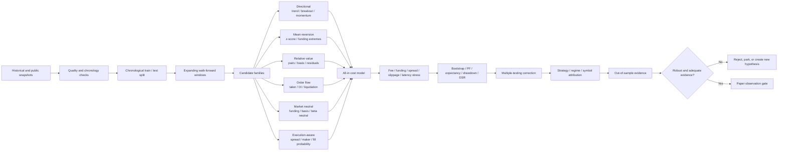

### Candidate families

The research engine can evaluate:

- Multi-timeframe trend continuation
- Volatility breakouts
- Pullback and failed-breakout logic
- Funding-rate mean reversion
- Basis dislocation
- VWAP and z-score reversion
- Open-interest and price divergence
- Taker-flow pressure
- Liquidation-event response
- Cross-sectional momentum
- Pairs and residual relative value
- Delta-neutral funding capture simulations
- Liquidity-aware execution
- Maker versus taker decision logic

A candidate is not enabled merely because it has a high backtest return. It must pass data, statistical, cost, stability, and forward-evidence checks.

---

## 7. Walk-forward evaluation flow

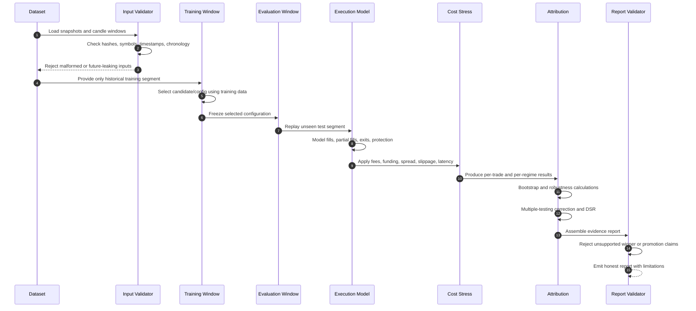

### Evaluation invariants

- Training data cannot select parameters using future test data.
- Incomplete trailing windows are excluded.
- Reordered candles are rejected.
- Costs are charged exactly once.
- Funding received offsets funding paid.
- Slippage is included in net PnL.
- Spread and execution slippage remain separately attributable.
- Results are reported per strategy, symbol, timeframe, regime, and window.
- Positive results with inadequate samples remain inconclusive.
- A single favorable window cannot establish a durable edge.

---

## 8. Deterministic sizing and portfolio risk

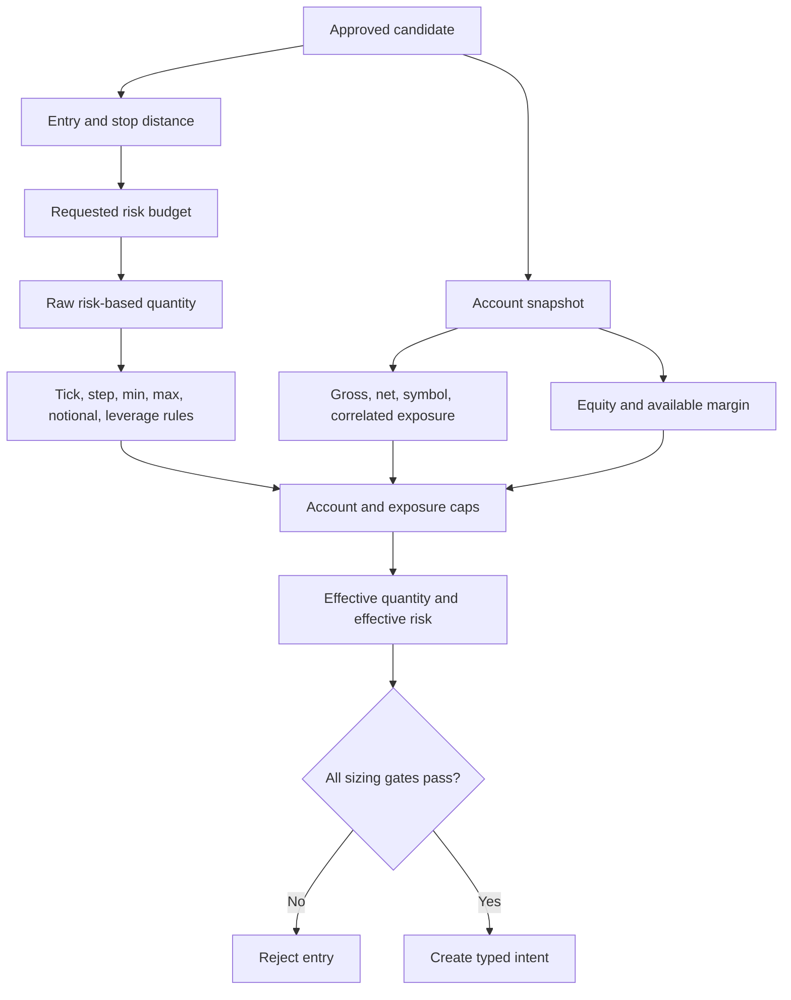

The provider cannot determine the final quantity. The deterministic sizing layer applies:

- Requested risk
- Stop distance
- Contract multiplier
- Venue quantity step
- Minimum and maximum notional
- Leverage cap
- Available equity
- Gross exposure
- Net exposure
- Correlated exposure
- Symbol concentration
- Drawdown and loss limits

Minimum-notional distortion is reported rather than hidden.

---

## 9. Paper execution lifecycle

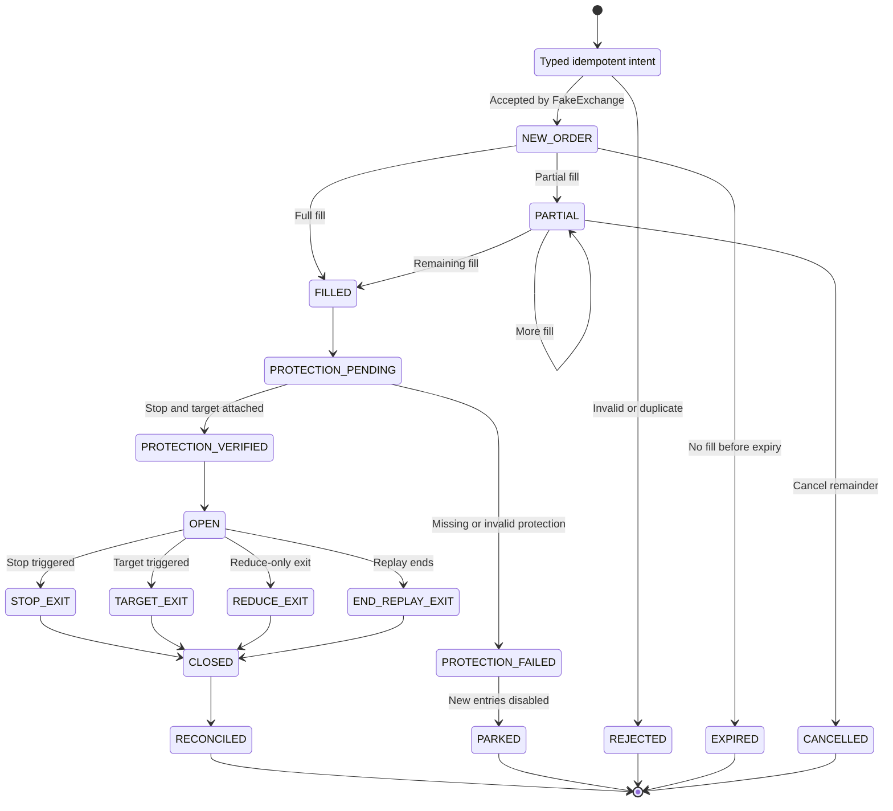

The paper exchange models:

- Market and limit orders
- Partial and complete fills
- Duplicate intent rejection
- Quantity and price constraints
- Bid and ask execution
- Adverse slippage
- Spread cost
- Fees
- Funding paid or received
- Reduce-only exits
- Stop and target protection
- Gap-through-stop behavior
- End-of-replay flattening
- Closed-trade accounting

The replay cannot finish with an unexplained open position. Any residual paper position receives a typed `END_OF_REPLAY` close using the final executable side.

---

## 10. Protection and reconciliation flow

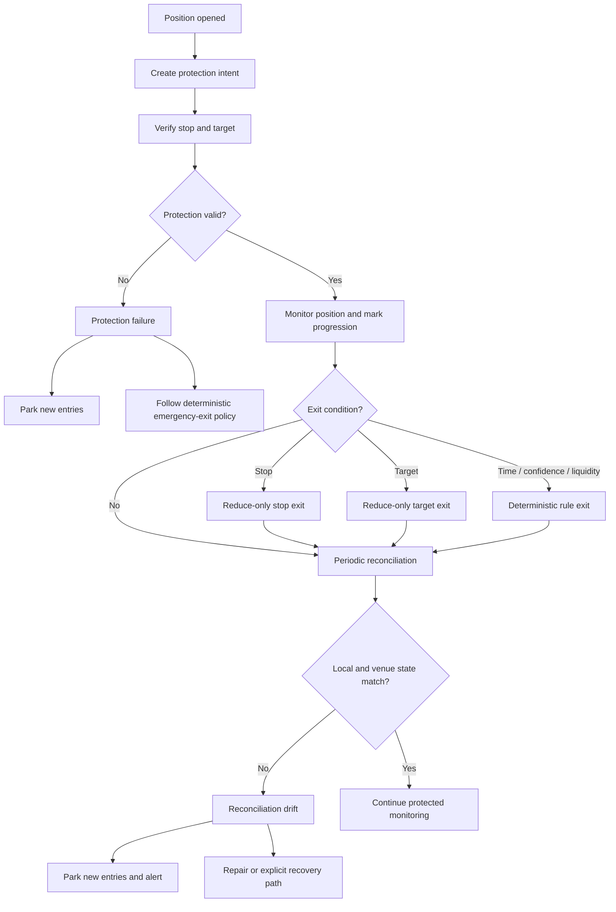

Protection rules:

- Existing positions continue to receive exit handling when new entries are parked.
- A missing stop or target is not treated as healthy.
- An order ID or HTTP success is not proof of a fill or resting protection order.
- Venue read-back is required for authenticated execution modes.
- Reconciliation happens after restart before new entries.
- A protection or reconciliation failure parks new entries.

---

## 11. Breakers and resource safety

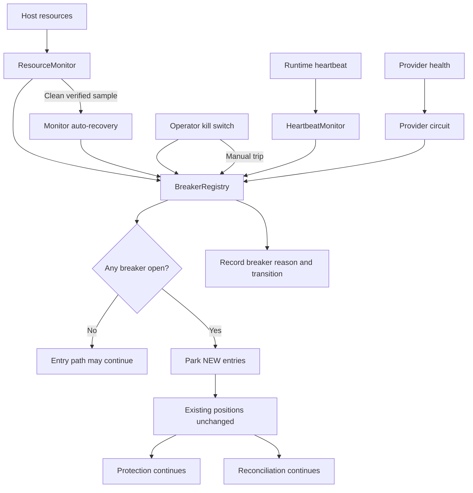

The resource breaker is separate from the preflight resource guard:

| Control | Purpose | Failure behavior |
|---|---|---|
| `scripts/resource_guard.py` | Protects heavy evaluation processes | Blocks or aborts heavy work when limits are exceeded |
| `ResourceMonitor` | Protects runtime entry path | Trips `resource` breaker and parks new entries |
| `BreakerRegistry` | Shared deterministic breaker state | Prevents entry when any required breaker is open |
| Protection supervisor | Protects existing positions | Continues exits and protection verification |
| Reconciliation | Detects local versus external drift | Parks entries and requires recovery |

The model cannot open or clear the resource breaker.

---

## 12. Full ledger and evidence flow

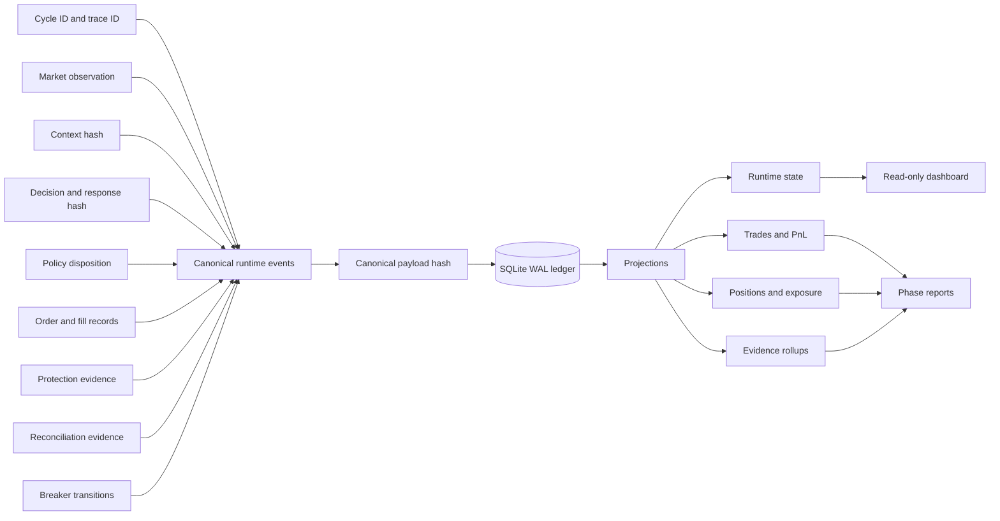

Important ledger properties:

- Append-only event records
- Canonical payload hashing
- Schema versions
- Cycle and trace identity
- Foreign keys
- SQLite WAL mode
- Transactional event and projection updates
- Rollback behavior under injected failures
- Durable snapshots
- Restart-safe projections
- Unknown-event rejection
- Bounded payload sizes

Typical event categories include:

```text
MARKET_OBSERVED
FEATURES_BUILT
AGENT_CONTEXT_BUILT
AGENT_DECISION
DECISION_REJECTED
POLICY_REJECTED
INTENT_APPROVED
ORDER_SUBMITTED
ORDER_ACKNOWLEDGED
FILL_OBSERVED
PROTECTION_ATTACHED
PROTECTION_VERIFIED
PROTECTION_FAILED
POSITION_RECONCILED
EXIT_OBSERVED
BREAKER_TRIPPED
BREAKER_RECOVERED
CYCLE_TERMINAL
```

Every decision stores enough metadata to replay it:

- Source snapshot hash
- Feature version
- Strategy version
- Configuration version
- Policy version
- Execution-model version
- Provider and model metadata, if applicable
- Prompt version, if applicable
- Raw response hash, if applicable
- Final disposition

---

## 13. Scheduler and continuous runtime flow

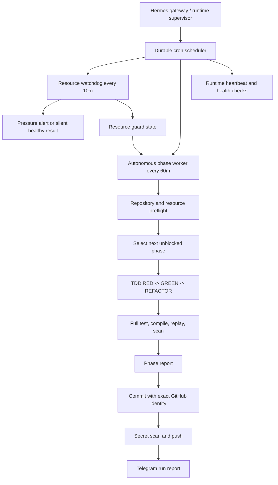

### Scheduler reality

Cron definitions can exist while the Hermes gateway is stopped. In that state:

- Jobs are saved.
- Jobs may show as enabled.
- Future scheduled ticks do not fire.
- Manual runs may still be possible through the control interface.
- The gateway must be running for continuous unattended scheduling.

This distinction is operationally important. A configured job is not the same as a currently executing job.

---

## 14. Autonomous phase-worker flow

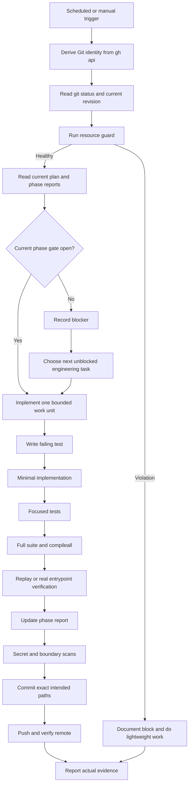

The worker must not stop merely because a promotion gate is negative. It should continue with unblocked work such as:

- Data-quality validation
- Cost-model improvements
- Walk-forward statistics
- Strategy attribution
- Protection and reconciliation
- Runtime health
- Resource safety
- Dashboard truthfulness
- Public-data research
- Documentation and reproducibility

---

## 15. Bounded model flow

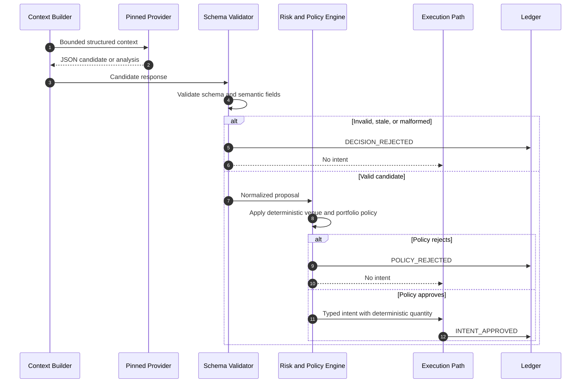

The model may:

- Rank precomputed candidates
- Summarize structured evidence
- Explain regime context
- Suggest research hypotheses
- Recommend rejection

The model may not:

- Invent prices or fills
- Choose arbitrary quantity or leverage
- Change stop or protection policy
- Disable breakers
- Alter allowlists
- Change risk limits
- Sign requests
- Submit orders directly
- Access secrets
- Promote a strategy

The current deterministic negative baseline keeps bounded LLM selection blocked for promotion purposes.

---

## 16. Promotion gate flow

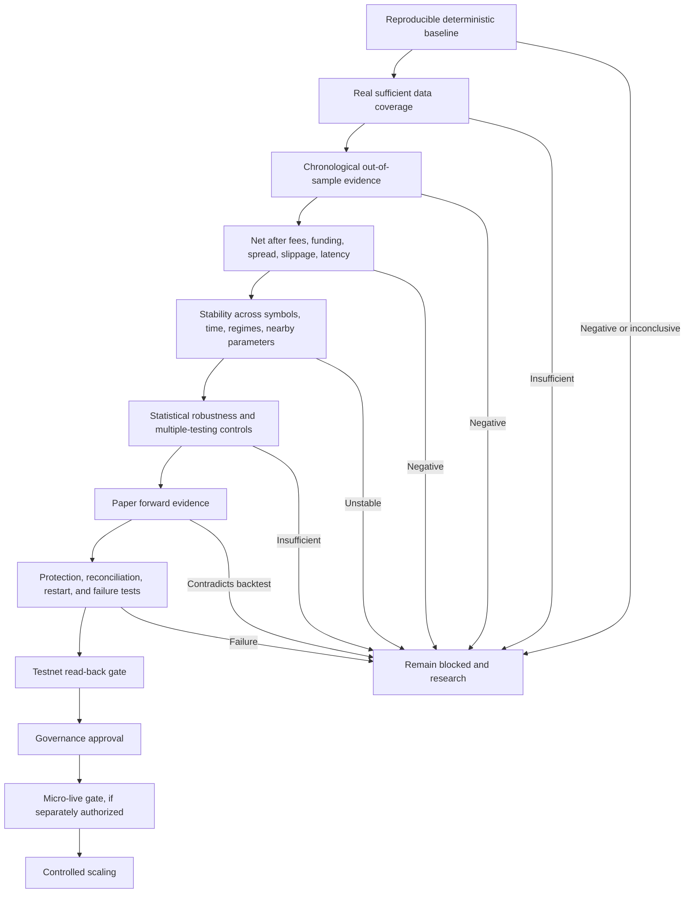

Promotion is blocked if any of the following occurs:

- Negative net PnL
- Inadequate trade count
- No independent out-of-sample period
- Cost-inclusive expectancy is not positive
- Results depend on one symbol or one exact parameter
- Forward paper evidence contradicts replay
- Protection cannot be proven
- Reconciliation cannot be proven
- Restart recovery fails
- Data quality is insufficient
- Resource safety is not operational
- Report evidence is incomplete or contradictory

User authorization does not replace statistical or safety evidence.

---

## 17. Current implementation reality

### Implemented and verified

- Append-only validated ledger
- SQLite WAL and transactional projections
- Deterministic paper exchange
- Fees, funding, spread, and slippage accounting
- End-of-replay flattening
- Deterministic sizing
- Portfolio exposure gates
- Public-data adapter and data-quality validation
- Versioned features
- Strategy and regime attribution
- Walk-forward evaluation
- Cost stress testing
- Multiple-testing and Deflated Sharpe measurement
- Report truthfulness guard
- Read-only dashboard projection
- Browser-responsive dashboard verification
- Heartbeat breaker
- Resource breaker
- Entry parking when breakers are open
- Resource-pressure end-to-end test
- Resource watchdog
- Bounded heavy-work resource guard
- Safe GitHub publication workflow

### Measurement-only or limited

- Public historical-data research is not funded execution.
- Synthetic adverse fixtures are not live profitability evidence.
- Paper protection is not authenticated venue protection.
- Paper reconciliation is not exchange reconciliation.
- The current runtime monitor still needs a permanent timer loop in the long-running service for continuous resource and heartbeat sampling.
- The dashboard has been verified primarily with empty-state data; populated-cycle density requires additional browser evidence.
- Phase 6 bounded LLM selection remains blocked by the negative deterministic baseline.

---

## 18. Current known findings

The deterministic baseline remains negative after realistic accounting.

Representative evidence includes:

```text
Promotion: blocked
Reason: NEGATIVE_NET_PNL
```

The system has intentionally become more conservative as accounting improved. Fees, funding, spread, and slippage are not hidden.

The correct engineering response is:

- Improve data coverage.
- Test structurally different hypotheses.
- Distinguish dead signals from sizing defects.
- Reduce fee bleed and overtrading.
- Test market-neutral and structural mechanisms.
- Preserve negative findings.
- Require independent forward evidence.

The incorrect response is to tune parameters until a report looks positive.

---

## 19. Operational runbook

### Run the baseline

```bash
python3 scripts/run_strategy_baseline.py \
  --output reports/phase-5/baseline.json
```

### Run the resource guard

```bash
python3 scripts/resource_guard.py --json
```

### Run all tests

```bash
python3 -m pytest -q
```

### Compile-check the project

```bash
python3 -m compileall -q src scripts tests
```

### Inspect repository state

```bash
git status --short --branch
git log -10 --oneline
```

### Inspect cron state

```bash
hermes cron list
hermes cron status
```

### Start the Hermes gateway for durable scheduling

```bash
hermes gateway status
hermes gateway start
```

Only start the gateway after checking the current process topology and resource condition. Starting the gateway is separate from enabling funded trading. It does not authorize exchange orders.

---

## 20. Summary in one diagram

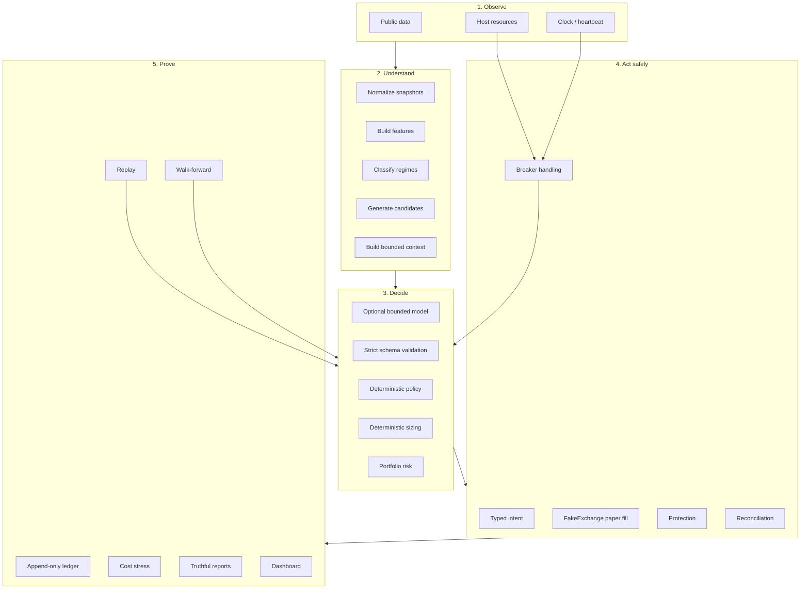

The complete system is therefore a closed evidence loop:

```text
Observe -> validate -> understand -> propose -> constrain -> size -> execute
-> protect -> reconcile -> record -> evaluate -> improve -> repeat
```

No stage is allowed to silently bypass the next stage, and no positive result is accepted without reproducible evidence.
